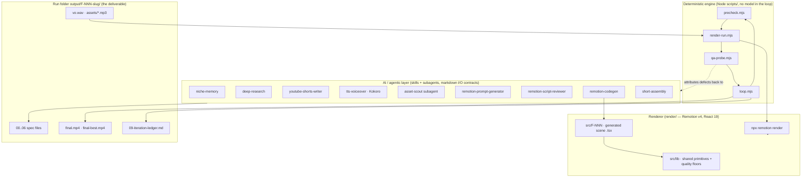
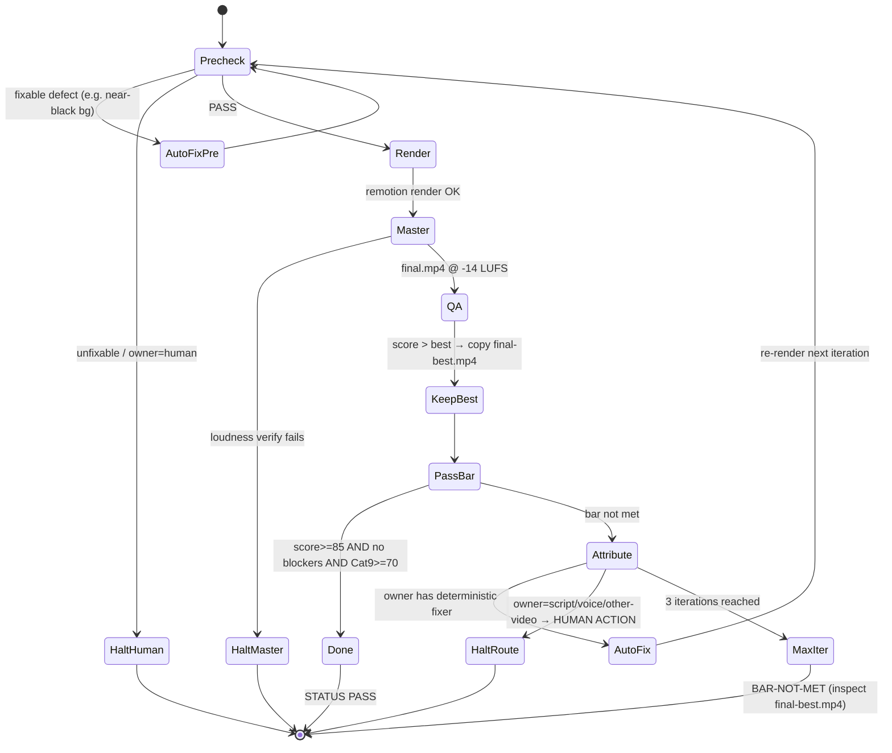
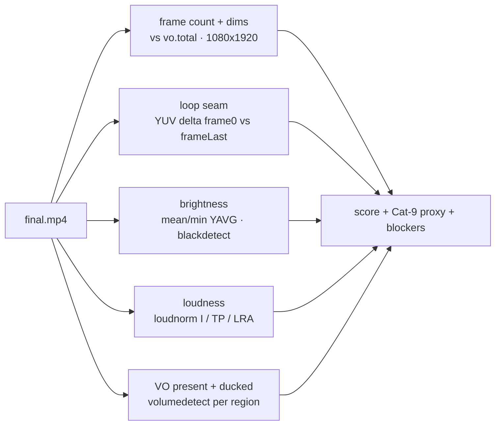
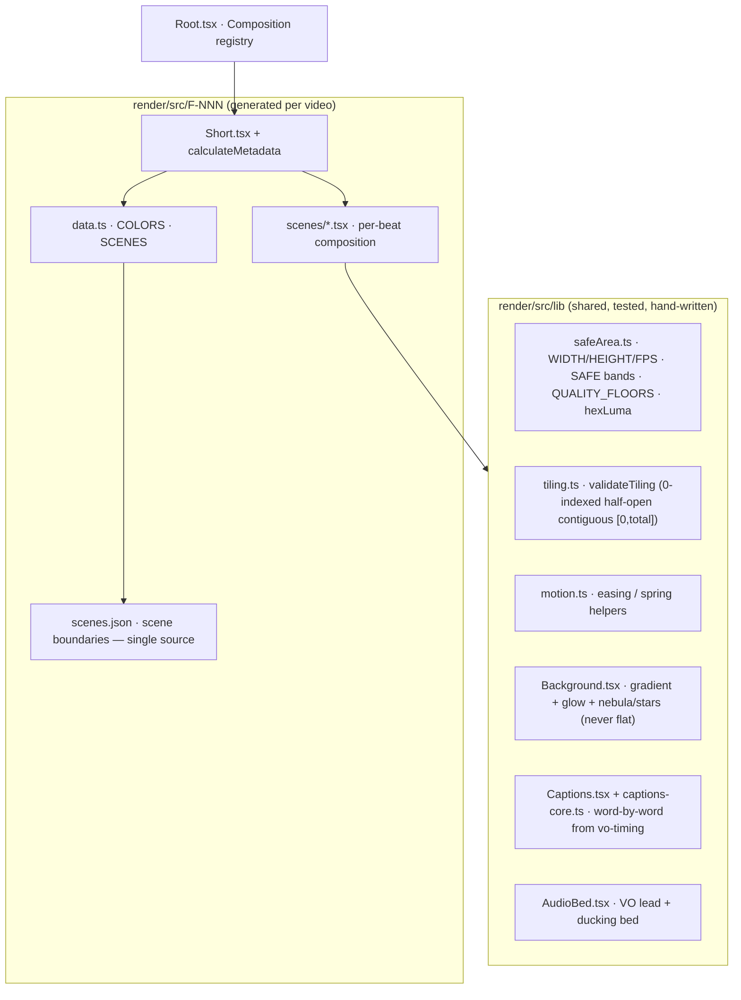
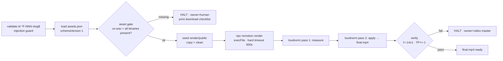

# ScriptWriter — Project Report

> The **Fathom Shorts Factory**: a single-command, agentic pipeline that turns a one-word topic into a rendered, audio-mastered, QA-passed, publish-ready vertical video — plus a self-contained, fully-sourced spec folder behind it.

**Report date:** 2026-06-18 · **Branch:** `fix/short-pipeline-visual-quality` · **Videos shipped:** F-001, F-002 (both `rendered`)

---

## 1. Executive summary

ScriptWriter is the build system for **Fathom**, a *faceless* YouTube Shorts channel in the **Facts / Kinetic Typography** niche (surprising facts told purely as animated text + motion — no footage, no camera, no presenter). Each video is authored as a **frame-timed script** and rendered programmatically with **Remotion** (React → MP4).

The headline capability is the **`/short` factory**: you type `/short [topic]` and an orchestrated chain of AI *skills* and *subagents* runs end-to-end:

```
topic → research → script → voiceover → assets → composition prompt
      → review → code generation → render → audio master → self-improving QA loop → human publish gate
```

The output is a **rendered, mastered (-14 LUFS), QA-passed `final.mp4`** together with a fully-traceable spec folder under `output/F-NNN-<slug>/` (topic, cited facts, script, voiceover, asset/audio specs, composition prompt, scorecards, iteration ledger).

What makes it more than a prompt chain is the **closed self-improving render loop**: after rendering, deterministic probes inspect the actual pixels and audio, *attribute* each defect to the stage that owns it, auto-fix what can be fixed mechanically, re-render, and repeat to a quality bar — or halt with a precise human-action routing.

---

## 2. What it is for, and why these choices

| Decision | Rationale (from `content/NICHES.md`, research report) |
|---|---|
| **Faceless Shorts** | No on-camera talent; scales infinitely; pure software pipeline. |
| **Facts / Kinetic Typography niche first** | Lowest production complexity in Remotion (text + motion only), broadest audience, near-infinite topic supply, easiest to make a recognizable signature. |
| **Remotion (React → MP4)** | Information *rendered as motion + text* is exactly Remotion's strength; deterministic, code-defined, reproducible frames. |
| **Local Kokoro TTS voiceover** | Free, offline, no API keys; the VO becomes the **timing source of truth** for the whole video. |
| **Cite-or-abstain facts** | Every spoken/on-screen claim must trace to a verbatim quote + URL, or it gets cut. Channel credibility is the moat. |
| **Self-improving loop** | A script can score 92/100 on paper and still render as a flat near-black void — only inspecting real pixels catches that. |

**Channel format rules** (apply to every video): frame 1 *is* the thumbnail (legible in <0.5s, no black fade-in), a cut every 2–4s, designed for an invisible loop, burned-in word-by-word captions, 1080×1920 @ 30fps, default 20–34s.

The niche roadmap (active → planned → backlog): **Facts/Kinetic Typography** (🟢 active) → Data Viz/Rankings → Explainer Motion Graphics → Code/Tech Explainers → Comparisons.

---

## 3. Repository map

```
ScriptWriter/
├── CLAUDE.md                 # project memory / the pipeline contract (authoritative)
├── MERGE_PLAN.md             # the plan that merged spec-generator + renderer into one repo
├── SETUP.md / Makefile       # bootstrap, doctor, render targets
├── README.md
│
├── .claude/
│   ├── commands/short.md     # the /short slash command (orchestrator entrypoint)
│   ├── agents/asset-scout.md # web-heavy asset-sourcing subagent
│   └── skills/               # 10 single-purpose skills (the pipeline stages)
│       ├── niche-memory/            # step 1  — pick a fresh topic, open run folder
│       ├── youtube-shorts-writer/   # step 3  — write the frame-timed script
│       ├── tts-voiceover/           # step 3.5 — Kokoro VO + timing contract
│       ├── asset-sourcing/          # step 4  — fonts/palette/motion + audio (spec)
│       ├── remotion-prompt-generator/ # step 5 — fuse into a composition prompt
│       ├── remotion-script-reviewer/  # step 6 — score/validate before render
│       ├── remotion-codegen/        # step 7  — emit per-video Remotion .tsx
│       ├── render-qa/               # step 8  — rich post-render pixel QA (human gate)
│       ├── short-assembly/          # step 9  — package + record side-effects
│       └── scriptwriter-skill/      # QUARANTINED (fictional screenplay, not used)
│
├── content/                  # channel state
│   ├── NICHES.md             # niche playbook
│   ├── VIDEO_LOG.md          # master record (dedupe + tracking)
│   ├── topic-backlog-facts.md
│   └── scripts/              # archived final scripts per video
│
├── scripts/                  # the deterministic orchestration engine (Node, no deps)
│   ├── bootstrap.sh / doctor.sh / seed-public.sh
│   ├── render-run.mjs        # render + two-pass loudnorm master  (Phase 1)
│   ├── precheck.mjs          # cheap pre-render gate              (loop stage)
│   ├── qa-probe.mjs          # deterministic pixel + loudness QA  (loop stage)
│   └── loop.mjs              # the closed self-improving loop      (D3)
│
├── output/                   # per-video run folders (the deliverables)
│   ├── F-001-cleopatra-vs-pyramids/
│   └── F-002-trex-closer-than-stegosaurus/
│
├── render/                   # the Remotion v4 monorepo subtree (React 19, TS)
│   ├── src/lib/              # shared primitive library (motion, captions, bg, audio, safe-area)
│   ├── src/F-001/ , src/F-002/   # per-video generated scenes
│   ├── src/Root.tsx          # Composition registry
│   ├── scripts/check-tiling.mjs
│   └── public/               # run-scoped, gitignored, repopulated each render
│
├── memory/lessons.md         # cross-run learnings (read at start, appended at end)
└── .venv-tts/                # gitignored Kokoro TTS venv (rebuilt by bootstrap)
```

---

## 4. Architecture at a glance

Two cooperating halves, merged into one repo (the "monorepo subtree" model):



- **AI layer** does the open-ended creative + research work; each skill has a strict markdown input/output contract and writes one numbered file.
- **Deterministic engine** does everything that must be repeatable and verifiable: rendering, mastering, measuring pixels/loudness, scoring, and looping. No LLM judgment lives in the auto-fix path.
- **Renderer** is a real Remotion project; per-video code is *generated* on top of a hand-written shared primitive library that bakes in the quality floors.

---

## 5. The `/short` pipeline — step by step

Each step **reads the prior step's file(s) and writes the next**. The orchestrator (`/short`) keeps a visible TodoWrite list mirroring these.

```mermaid
flowchart TD
    T(["/short [topic]"]) --> L0[Step 0: read memory/lessons.md + CLAUDE.md]
    L0 --> S1[1 · niche-memory → 00-topic.md<br/>pick fresh topic · allocate F-NNN · make run folder]
    S1 --> S2[2 · deep-research → 01-verified-facts.md<br/>claims table: quote+URL+confidence · cite-or-abstain]
    S2 --> S3[3 · youtube-shorts-writer → 02-script.md<br/>narration block + on-screen text + EMPTY frame map]
    S3 --> S35[3.5 · tts-voiceover → vo.wav + vo-timing.json<br/>Kokoro · integer-frame timing · patches frame map]
    S35 -->|overrun > target+15%| S3
    S35 --> S4[4 · asset-scout → 03-assets.md + 04-audio.md<br/>fonts/palette/motion + monetization-safe audio · SPEC ONLY]
    S4 --> S5[5 · remotion-prompt-generator → 05-remotion-prompt.md]
    S5 --> S6{6 · remotion-script-reviewer<br/>score 02 AND 05 · max 3 passes}
    S6 -->|score<80 · blocker · Cat9<~70%| S5
    S6 -->|pass → 06-scorecard.md| S7[7 · remotion-codegen → render/src/F-NNN/<br/>scene .tsx + data.ts + scenes.json + Composition entry + assets.json]
    S7 --> GATE{codegen gate<br/>tsc+eslint · test:lib · check-tiling}
    GATE -->|fail| S7
    GATE -->|pass| S8[[8 · render + self-improving QA loop<br/>scripts/loop.mjs]]
    S8 --> S9[9 · short-assembly → README · VIDEO_LOG row · archive · lessons]
    S9 --> S10([10 · Human publish gate<br/>review final.mp4 · upload = human · AI disclosure = YES])
```



### Step reference

| # | Stage | Tool | Reads | Writes |
|---|---|---|---|---|
| 0 | Start | — | `memory/lessons.md`, `CLAUDE.md` | — |
| 1 | Topic | **niche-memory** skill | VIDEO_LOG, scripts, backlog | `00-topic.md`, run folder |
| 2 | Research | **/deep-research** | the web (verified) | `01-verified-facts.md` |
| 3 | Script | **youtube-shorts-writer** | `00`,`01` | `02-script.md` (narration + empty frame map) |
| 3.5 | Voice | **tts-voiceover** (Kokoro) | narration block | `vo.wav`, `vo-timing.json`, patches frame map |
| 4 | Assets | **asset-scout** subagent | `02` | `03-assets.md`, `04-audio.md` (spec only) |
| 5 | Prompt | **remotion-prompt-generator** | `02`,`03`,`04` | `05-remotion-prompt.md` |
| 6 | Review | **remotion-script-reviewer** | `02`+`05`, `vo-timing.json` | `06-scorecard.md` |
| 7 | Codegen | **remotion-codegen** | `05`,`03`,`04`,`vo-timing.json` | `render/src/F-NNN/*`, `assets.json` |
| 8 | Render+QA | `scripts/loop.mjs` (engine) | run folder + scenes | `final.mp4`, `final-best.mp4`, `09-iteration-ledger.md` |
| 9 | Assembly | **short-assembly** | the whole run | `README.md`, VIDEO_LOG row, archived script, lessons |
| 10 | Publish | human | `final.mp4`, ledger | YouTube upload (AI disclosure = YES) |

**Key principle — the VO sets the timing.** The writer (step 3) leaves the frame map *empty*. Kokoro (step 3.5) speaks the narration, derives integer-frame word timing, sets `total` = `durationInFrames`, and *patches* the frame-map table back into the script. Everything downstream (captions, scene boundaries, composition duration) is computed from `vo-timing.json` — never hand-counted.

---

## 6. The closed self-improving render loop (step 8)

This is the system's most distinctive piece. `scripts/loop.mjs` runs up to 3 iterations of **precheck → render → QA → attribute → auto-fix**, keeping the best render and writing a ledger.



**The quality bar:** `score ≥ 85` **and** zero blockers **and** `Cat9 ≥ 70`.

### Stage attribution — defects route to their owner

The loop never blindly retries; it *attributes* each defect to the stage that can actually fix it.

| Defect class | Owner | Auto-fixable? | Re-run path |
|---|---|---|---|
| Over-long / weak / unsourced narration, word pacing | **script** | no (≤1 re-cut/loop budget) | youtube-shorts-writer → tts-voiceover |
| VO too fast/slow/robotic, caption frames off, overrun | **voice** | no | tts-voiceover (or back to script to cut) |
| Near-black / flat background | **video** | **yes** — `fixBgFromSpec` | regenerate bg gradient tokens from the `05` palette |
| Other video defects (dead space, invisible mechanic, loop seam, scale-dishonest viz, glyph collision) | **video** | no | asset-sourcing / prompt-generator → codegen |
| Quiet / clipping master | **video (master)** | **yes** — re-master | two-pass loudnorm only |
| Missing licensed music/SFX binary | **human** | no | download per `04-audio.md` |

**Deterministic auto-fixers** currently implemented (the only places the loop edits code itself):
1. `fixBgFromSpec` — re-reads the spec gradient (`#top → #bottom`) from `05-remotion-prompt.md` and rewrites `bgTop`/`bgBottom` in the video's `data.ts`. Heals the flat-void failure mode.
2. **Re-master** — re-runs the two-pass `loudnorm` for an off-target loudness.

Everything else is *attributed* and the loop **halts with a precise HUMAN ACTION** routing line in the ledger (e.g. `HALT-NO-FIXER owner=video — restore depth gradient`). The loop also enforces **monotonicity** (a re-render must strictly beat the prior best, else abort — no oscillation) and a **script re-cut budget** of 1 per loop.

---

## 7. The QA probe — how "quality" is measured deterministically

`scripts/qa-probe.mjs` runs `ffmpeg`/`ffprobe` against the rendered `final.mp4` and the `vo-timing.json` contract, with no model in the loop. It checks the programmatically-decidable subset of the full `render-qa` skill:



| Check | Threshold | Severity |
|---|---|---|
| Frame count vs `vo.total` | within ±1 | blocker |
| Dimensions | exactly 1080×1920 | blocker |
| Mean luma (`YAVG`) | ≥ 30 (`LUMA_MEAN_MIN`) | blocker (the "near-black void") |
| Black-screen stretch | < 1.5s | blocker |
| Loudness | I within ±1 of -14 LUFS, TP ≤ -1 dBTP | blocker (`video (master)`) |
| VO present | track mean > -50 dB | blocker (`voice`) |
| Loop seam | YUV delta ≤ 6 | **warning** |

**Scoring formula:**
```
score = 100 − 25·(#blockers) − 6·(#warnings)     (clamped ≥ 0)
Cat9  = clamp( (lumaMean − 20) / (45 − 20) · 100, 0, 100 )   # the "is the frame lit and alive" proxy
pass  = (#blockers == 0) AND (score ≥ 85) AND (Cat9 ≥ 70)
```

`Category 9 — Visual Design Quality` exists because of a real lesson: F-001 scored 92/100 on the original rubric and still rendered as a near-black void, because nothing graded *visual* quality. The Cat-9 proxy ties part of the score to actual rendered luminance.

The richer per-beat human judgment (glyph collisions, mechanic legibility, dead-space per scene) lives in the **render-qa skill**, run optionally at the human publish gate (step 10).

---

## 8. The renderer (`render/`)

A real Remotion v4 project (React 19, TypeScript, Tailwind v4, 1080×1920 @ 30fps), living as a **monorepo subtree** — one repo, one pipeline. `node_modules/` and the TTS venv are gitignored and rebuilt by `bootstrap.sh`.

### Codegen-first architecture

Per-video code is **generated** by the `remotion-codegen` skill into `render/src/F-NNN/`, sitting on a **shared, hand-written primitive library** `render/src/lib/` that enforces the quality floors *by construction*:



### Hard gates codegen must pass (no hand edits allowed)

```bash
cd render && npm run gate          # tsc + eslint
            && npm run test:lib    # pure-logic unit tests (node --experimental-strip-types)
            && node --experimental-strip-types scripts/check-tiling.mjs F-NNN
```

Plus structural rules enforced by the lib + precheck:
- **Duration via `calculateMetadata`** reading `vo-timing.json` `total` — *never* a hardcoded `DURATION` const (this was the F-001 v1 bug).
- **Quality floors** (`safeArea.ts`): hero type ≥ 300px, background must be `gradient(≥2 stops) + glow + nebula/stars` (never flat single hex), scene fill ≥ 0.55, count-up ≤ 36 frames, caption baseline clears the bottom 288px gutter, lay out the **full** safe area in upper/center/lower bands (not clustered at center).
- **Scene tiling** (`tiling.ts`): scene ranges must be 0-indexed, half-open, contiguous, and tile `[0, total]` exactly — same contract as the frame-map validator.

### Render → master → verify (`render-run.mjs`)



Security is taken seriously here: the run id is validated against `^F-\d{3}-[a-z0-9-]+$`, asset names are basename-only + charset-checked, every external process is spawned with `execFile` (array args, **no shell**), and the render has a hard `SIGKILL` timeout.

### `render/public/` strategy — copy + clean, not symlink

`render/public/` holds only run-scoped binaries (`vo.wav`, music, SFX) and is gitignored. `seed-public.sh` wipes it and repopulates from the active run folder before every render, so there's never cross-run staleness. Canonical copies live in `output/F-NNN/` (`vo.wav` at the root, music/SFX in `assets/`).

---

## 9. Data & file contracts

The pipeline is glued together by a handful of well-defined files. The most load-bearing:

| File | Producer | Role |
|---|---|---|
| `vo-timing.json` | tts-voiceover | **The timing source of truth.** `total` (= durationInFrames), `fps`, `speech_regions`, per-word frames, ducking envelope. |
| `02-script.md` frame-map block | writer (empty) → VO (patched) | Tiled `[0, total]` scene/caption table; validated by the reviewer. |
| `scenes.json` | codegen | Scene order + `from` frames — the single source the render derives `SCENES` from and `check-tiling.mjs` reads. |
| `data.ts` | codegen | `COLORS` (incl. `bgTop`/`bgBottom`) + derived `SCENES`. The auto-fixer rewrites the bg tokens here. |
| `assets.json` | codegen | `schemaVersion: 1`, `compositionId`, `vo`, `assets[]` (file/url/license). Drives the pre-render asset gate. |
| `09-iteration-ledger.md` | loop | Per-iteration table (score, Cat9, blockers, owner, fix) + terminal `STATUS:`. |

These are deliberately separated so each can be validated independently and a defect can be traced to exactly one file.

---

## 10. Non-negotiable standards

From `CLAUDE.md` — these are enforced, not aspirational:

- **Facts:** every spoken/on-screen claim traces to a verbatim quote + URL in `01-verified-facts.md`, or it's cut. Prefer "abstain" over guessing.
- **Audio:** monetization-safe music/SFX only (YouTube Audio Library / Pixabay / Uppbeat free tier or paid pre-cleared); **no CC-BY-NC**; license + attribution recorded; downloaded from the original source. **VO is the lead; the bed ducks under it** (~0.72 → ~0.22 under speech, swelling on the payoff). **Always master to -14 LUFS / ≤ -1 dBTP** via two-pass `loudnorm` — YouTube never boosts quiet masters.
- **Frame math:** the VO sets timing; the frame-map table must pass the reviewer's validator (reads `total`, tiles `[0,total]`). Trust the validator over manual math.
- **Format:** 1080×1920 @ 30fps; frame 1 is the legible thumbnail (no black fade-in lead); a cut every 2–4s; designed for an invisible loop; burned-in word-by-word captions clear of the bottom ~15% and the top.
- **AI disclosure:** the synthetic Kokoro voice means **"Altered or synthetic content" = YES** on every upload.

### Completeness gate (must pass before "done")
1. Every claim sourced in `01-verified-facts.md`. 2. Audio monetization-safe, bed ducks, `final.mp4` measures -14 LUFS / ≤ -1 dBTP. 3. `vo.wav` + `vo-timing.json` present; captions derived from VO. 4. Frame math + tiling validators pass. 5. `final.mp4` rendered and loop `STATUS: PASS` (or a human accepted `final-best.mp4`); ledger records the rounds. 6. README AI-disclosure = YES.

---

## 11. Setup & tooling

```bash
bash scripts/bootstrap.sh        # .venv-tts (Kokoro/misaki/soundfile/numpy) + render/ npm i + seed F-001 public
make doctor                      # assert node/npm/ffmpeg/ffprobe/python/venv/espeak; prints each gap
make render-f001                 # render + master the F-001 baseline
make render RUN=output/F-NNN-slug
```

| Need | Why | Notes |
|---|---|---|
| Node 18+ / npm | Remotion render | — |
| ffmpeg + ffprobe | silence-trim, ducking, two-pass loudnorm master, QA probes | core dependency |
| python3 3.10+ | TTS timing + Kokoro | — |
| `.venv-tts` | local voiceover (free, offline) | gitignored, rebuilt by bootstrap |
| espeak-ng | phonemizer for Kokoro | **ships inside misaki's `espeakng-loader` wheel — no apt/sudo** |

Kokoro-82M weights (Apache-2.0) auto-download from Hugging Face on first VO run. New skills/subagents need a Claude Code reload before first auto-invocation.

---

## 12. Skills & subagents inventory

Skills are single-purpose with markdown I/O contracts; subagents isolate web-heavy steps (they can't see conversation history — file paths are passed explicitly).

| Component | Type | Pipeline role |
|---|---|---|
| `niche-memory` | skill | 1 — fresh topic + run folder |
| `deep-research` | skill | 2 — fan-out/verify/synthesize cited facts |
| `youtube-shorts-writer` | skill | 3 — frame-timed script |
| `tts-voiceover` | skill | 3.5 — Kokoro VO + timing contract |
| `asset-scout` | **subagent** | 4 — fonts/palette/motion + audio (calls asset-sourcing) |
| `asset-sourcing` | skill | 4 — the actual sourcing logic |
| `remotion-prompt-generator` | skill | 5 — composition prompt |
| `remotion-script-reviewer` | skill | 6 — score/validate |
| `remotion-codegen` | skill | 7 — emit `.tsx` |
| `render-qa` | skill | 8/10 — rich post-render pixel QA |
| `short-assembly` | skill | 9 — package + record |
| `scriptwriter-skill` | skill | **quarantined** — fictional screenplay, NOT in this pipeline |

---

## 13. Current state

| ID | Topic | Hook | Len | Status | Result |
|---|---|---|---|---|---|
| **F-001** | Cleopatra vs Pyramids vs Moon landing | "Cleopatra is closer to YOU than to the Pyramids." | 31s | rendered | Kokoro `am_michael` 930f; reviewer 93/100; codegenned + rendered + mastered (-13.7 LUFS); AI disclosure = YES |
| **F-002** | T. rex closer to you than to Stegosaurus | "T. rex lived closer to you than to Stegosaurus." | 24s | rendered | Fresh topic end-to-end; same vertical-timeline archetype, scale-honest gaps; 720f; codegen **zero hand edits**; loop **PASS score 94 / Cat9 98**, -14.01 LUFS |

F-002 is the proof point: a brand-new topic ran the *entire* merged factory — topic → facts → script → VO → assets → codegen → render → master → QA loop → PASS — with zero hand edits, by reusing F-001's "vertical timeline / 3 nodes / 2 scale-honest gaps" archetype.

Both videos share the emerging **Fathom signature**: monospace digit face (Space Mono) for jitter-free count-ups paired with a heavy grotesque display face, a depth gradient background, and a vertical timeline that turns "closer in time" into a *spatial* fact.

---

## 14. Roadmap / open items

From `MERGE_PLAN.md` and `memory/lessons.md`:

- **Parametric `compose.json` engine — backlogged** behind a decision gate after 5–6 videos. The codegen-first approach (D2) is deliberate; do *not* build the engine yet — keep generating scene `.tsx` on the shared lib.
- **Loop-seam refinement** (F-002, non-blocking): the QA loop-seam YUV delta was 7.2 (>6) because persistent furniture (timeline/bars) is full at the tail but empty at frame 0, while the LoopBack cross-dissolve only covers the text layer. Codegen should freeze/reset persistent furniture to its frame-0 state during the loop tail.
- **Master dynamics:** two-pass `loudnorm linear=false` lands -14 LUFS but collapsed F-001's LRA to ~3 (target 11). Not a blocker (loudness is correct), but worth `linear=true` or skipping the master on already-close mixes if dynamics matter.
- **Niche expansion:** prove Niche 1 (consistent uploads, find what retains) before adding Data Viz / Rankings — ideally as a clearly-branded series so each niche keeps a coherent seed audience.

---

## 15. Glossary

| Term | Meaning |
|---|---|
| **F-NNN** | Video id; `F` = Facts niche (also D/E/C/X for future niches), `-NNN` sequential. |
| **Run folder** | `output/F-NNN-<slug>/` — the self-contained deliverable for one video. |
| **VO** | Voiceover (local Kokoro TTS); the timing source of truth. |
| **Frame map** | The tiled scene/caption table inside `02-script.md`, patched from `vo-timing.json`. |
| **Quality floors** | Hard minimums in `safeArea.ts` (hero px, bg depth, fill, count-up speed) enforced by construction. |
| **Cat 9** | "Visual Design Quality" rubric category; in the loop, a luma-based proxy (≥70 to pass). |
| **The bar** | Loop pass condition: score ≥ 85, zero blockers, Cat9 ≥ 70. |
| **Attribution** | Mapping each QA defect to the owning stage (script / voice / video / video(master) / human). |
| **`final-best.mp4`** | The highest-scoring render kept across loop iterations. |

---

*Generated from a full read of `CLAUDE.md`, `MERGE_PLAN.md`, `SETUP.md`, the `scripts/` orchestration engine (`loop.mjs`, `render-run.mjs`, `qa-probe.mjs`, `precheck.mjs`), the `render/` Remotion project, the skills/subagents, the two run folders, and `memory/lessons.md`. Mermaid diagrams render on GitHub and in most Markdown viewers.*
